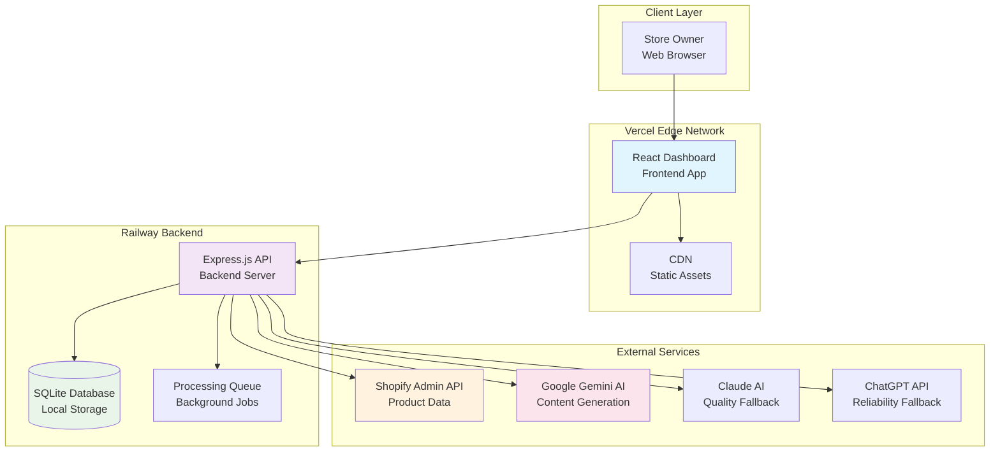
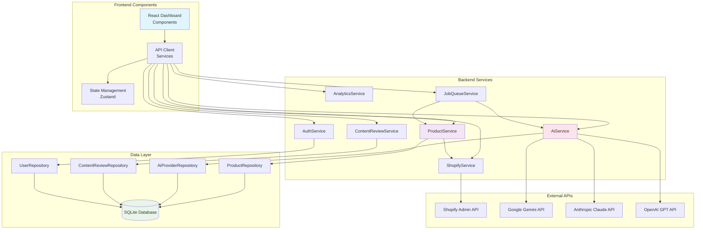
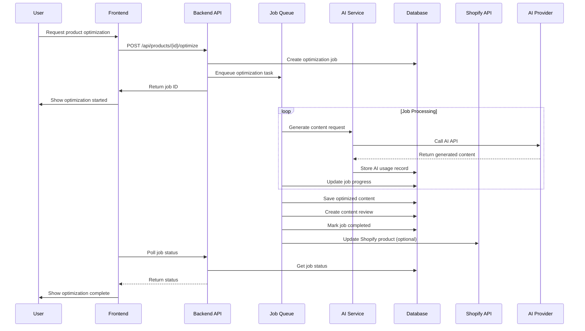
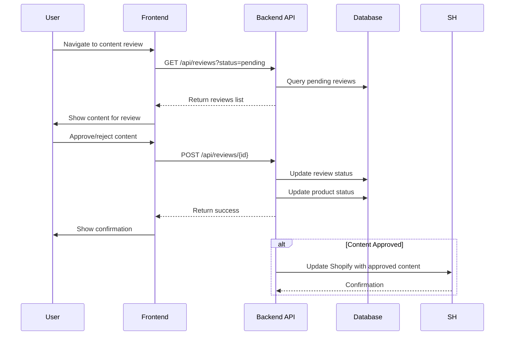
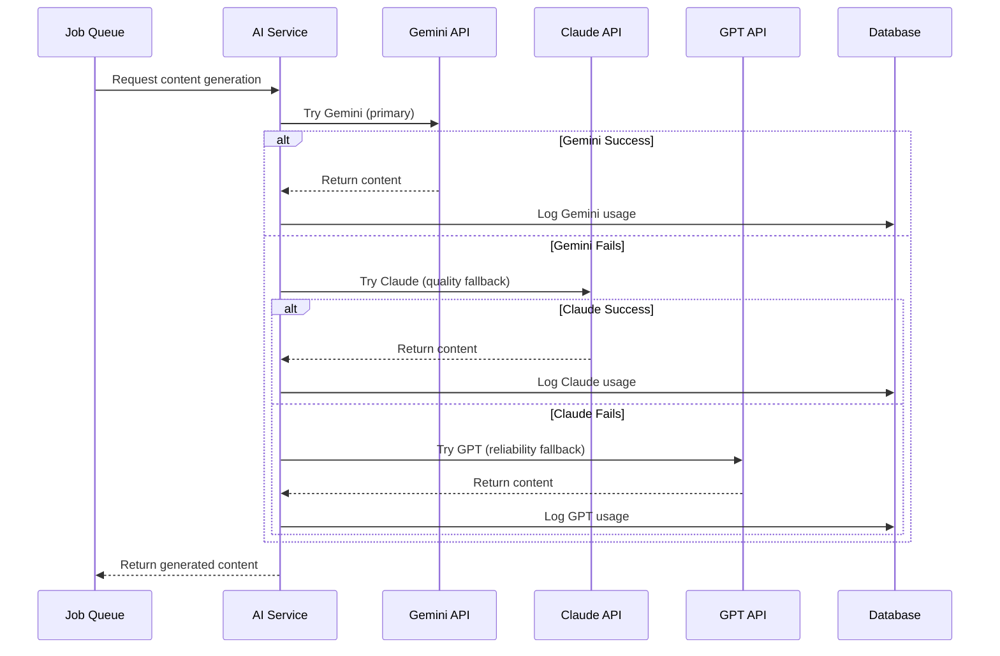
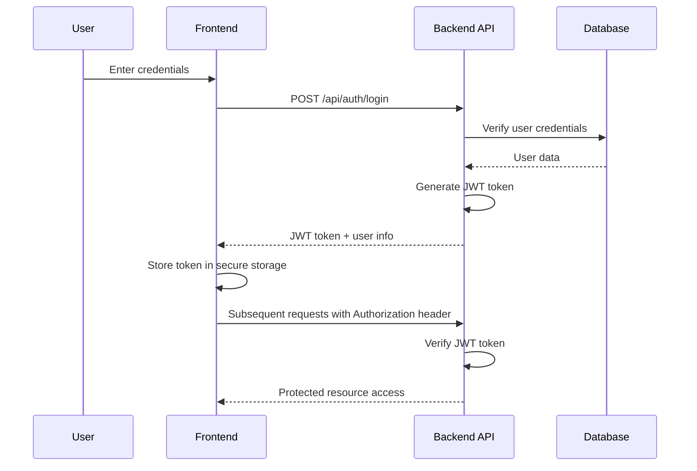
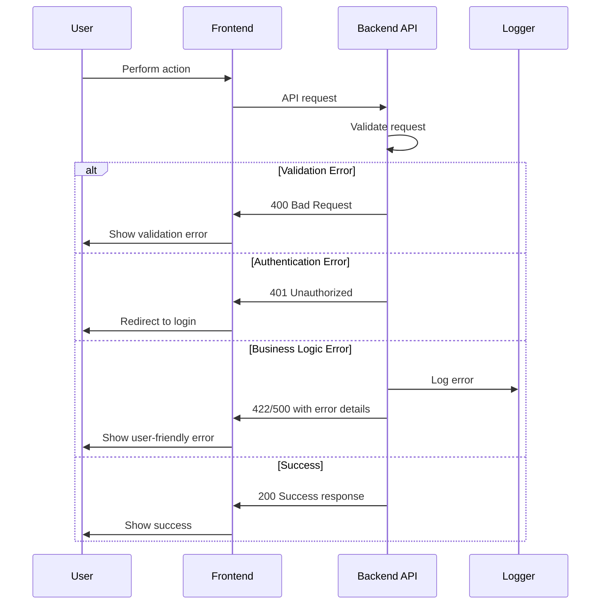

# Jewelry SEO Automation Fullstack Architecture Document

## **Section 1: Introduction**

This document outlines the complete fullstack architecture for Jewelry SEO Automation, including backend systems, frontend implementation, and their integration. It serves as the single source of truth for AI-driven development, ensuring consistency across the entire technology stack.

This unified approach combines what would traditionally be separate backend and frontend architecture documents, streamlining the development process for modern fullstack applications where these concerns are increasingly intertwined.

### **Starter Template or Existing Project**
N/A - Greenfield project based on PRD requirements for Node.js/Express monolithic architecture with Shopify and AI API integrations.

### **Change Log**
| Date | Version | Description | Author |
|------|---------|-------------|---------|
| 2025-09-25 | v1.0 | Initial architecture creation | Winston (Architect) |

---

## **Section 2: High Level Architecture**

### **Technical Summary**
The Jewelry SEO Automation system employs a monolithic Node.js/Express architecture with a web-based dashboard frontend, providing a comprehensive solution for automated jewelry SEO optimization. The system integrates Shopify Admin API for product data extraction, multiple AI providers (Gemini, Claude, GPT) for content generation, and SQLite for local data storage. This architecture prioritizes data security, cost control through free AI tiers, and rapid development within the 2-week sprint timeline while maintaining scalability for the growing jewelry business.

### **Platform and Infrastructure Choice**

**Platform:** Vercel + Railway
**Key Services:** Vercel (frontend hosting), Railway (backend hosting), SQLite (local database), Multiple AI APIs (Gemini/Claude/GPT)
**Deployment Host and Regions:** Vercel global edge network, Railway US-East region

**Platform Analysis:**
- **Vercel + Railway**: Optimized for rapid development, excellent developer experience, free tiers available, seamless Git integration. Perfect for the 2-week sprint timeline.
- **AWS Full Stack**: More enterprise-scale but complex setup and higher costs. Overkill for this project scope.
- **Heroku + Netlify**: Alternative option but Railway provides better backend hosting for Node.js applications.

**Recommendation:** Vercel + Railway provides the best balance of rapid deployment, cost efficiency, and scalability for this jewelry SEO automation project.

### **Repository Structure**

**Structure:** Monorepo
**Monorepo Tool:** npm workspaces (simple, lightweight, perfect for small team)
**Package Organization:**
- `apps/web` - Frontend React application
- `apps/api` - Backend Node.js/Express API
- `packages/shared` - Shared TypeScript types and utilities
- `packages/ui` - Reusable UI components

Monorepo structure enables code sharing between frontend and backend while maintaining clear separation of concerns. npm workspaces provides the simplest approach for the 2-week development timeline.

### **High Level Architecture Diagram**



### **Architectural Patterns**

- **Monolithic Architecture**: Single deployment unit with clear internal separation - _Rationale:_ Optimal for rapid 2-week development while maintaining scalability for the jewelry business needs
- **Component-Based UI**: Reusable React components with TypeScript - _Rationale:_ Maintainability and type safety across the dashboard interface
- **Repository Pattern**: Abstract data access logic with SQLite - _Rationale:_ Enables testing and future database migration flexibility
- **API Gateway Pattern**: Single Express.js entry point for all client requests - _Rationale:_ Centralized auth, rate limiting, and monitoring for the SEO automation system
- **Service Layer Pattern**: Business logic separated from API routes - _Rationale:_ Clean separation of concerns for content generation, Shopify integration, and data management
- **Background Job Pattern**: Queue-based processing for AI content generation - _Rationale:_ Prevents blocking requests during long-running AI operations
- **Circuit Breaker Pattern**: AI provider failover mechanism - _Rationale:_ Ensures system reliability when individual AI services are unavailable

---

## **Section 3: Tech Stack**

### **Technology Stack Table**

| Category | Technology | Version | Purpose | Rationale |
|----------|------------|---------|---------|-----------|
| **Frontend Language** | TypeScript | 5.0+ | Type-safe frontend development | Prevents runtime errors, enables better tooling, aligns with backend |
| **Frontend Framework** | React | 18.3+ | Dashboard UI and user interactions | Component-based architecture, excellent ecosystem, perfect for dashboards |
| **UI Component Library** | Tailwind CSS + Headless UI | 3.4+ | Styling and UI components | Rapid development, consistent design system, accessibility-focused |
| **State Management** | Zustand | 4.5+ | Client-side state management | Lightweight, simple API, TypeScript support, perfect for dashboard state |
| **Backend Language** | TypeScript | 5.0+ | Type-safe backend development | Full-stack type consistency, better error handling, improved developer experience |
| **Backend Framework** | Express.js | 4.19+ | API server and business logic | Mature, lightweight, excellent middleware ecosystem, rapid development |
| **API Style** | REST API | OpenAPI 3.0 | Frontend-backend communication | Simple, well-understood, excellent tooling support, cache-friendly |
| **Database** | SQLite | 3.45+ | Local data storage | Zero configuration, local file-based, perfect for security requirements |
| **Cache** | Node-Cache | 5.1+ | In-memory caching | Simple, effective, reduces AI API calls, improves performance |
| **File Storage** | Local File System | - | Backup storage for content | Simple, secure, meets backup requirements without external dependencies |
| **Authentication** | JWT + Session | - | Dashboard access control | Simple, stateless, sufficient for single-user dashboard |
| **Frontend Testing** | Vitest + React Testing Library | 1.6+ | Frontend unit and integration tests | Fast, modern, excellent React support |
| **Backend Testing** | Jest + Supertest | 29.7+ | Backend API and service tests | Comprehensive testing framework, good Express support |
| **E2E Testing** | Playwright | 1.40+ | End-to-end workflow testing | Reliable, fast, excellent for dashboard workflows |
| **Build Tool** | Vite | 5.0+ | Frontend build tooling | Extremely fast, excellent development experience |
| **Bundler** | esbuild | - | JavaScript bundling | Blazing fast, integrated with Vite |
| **IaC Tool** | Railway + Vercel Config | - | Infrastructure as Code | Platform-specific configuration, minimal setup required |
| **CI/CD** | GitHub Actions | - | Continuous integration and deployment | Native GitHub integration, excellent marketplace actions |
| **Monitoring** | Railway + Vercel Analytics | - | Application monitoring | Built-in platform monitoring, sufficient for initial needs |
| **Logging** | Winston + Morgan | 3.11+ | Structured logging | Comprehensive logging, different transport options |
| **CSS Framework** | Tailwind CSS | 3.4+ | Utility-first styling | Rapid development, consistent design, easy maintenance |

---

## **Section 4: Data Models**

### **Product**

**Purpose:** Represents jewelry products from Shopify store with SEO content and optimization status

**Key Attributes:**
- id: string - Unique product identifier from Shopify
- title: string - Product title
- description: string - Original product description
- price: number - Product price in NZD
- vendor: string - Product vendor/brand
- productType: string - Product category/type
- tags: string[] - Product tags
- images: string[] - Product image URLs
- variants: ProductVariant[] - Product variants
- seoTitle: string - SEO-optimized title
- seoDescription: string - SEO-optimized meta description
- optimizedDescription: string - AI-optimized product description
- optimizationStatus: OptimizationStatus - Current optimization status
- lastOptimized: Date - Last optimization timestamp
- createdAt: Date - Product creation date
- updatedAt: Date - Last update date

**TypeScript Interface:**
```typescript
interface Product {
  id: string;
  title: string;
  description: string;
  price: number;
  vendor: string;
  productType: string;
  tags: string[];
  images: string[];
  variants: ProductVariant[];
  seoTitle?: string;
  seoDescription?: string;
  optimizedDescription?: string;
  optimizationStatus: OptimizationStatus;
  lastOptimized?: Date;
  createdAt: Date;
  updatedAt: Date;
}

interface ProductVariant {
  id: string;
  title: string;
  price: number;
  sku: string;
  inventoryQuantity: number;
}

type OptimizationStatus = 'pending' | 'processing' | 'completed' | 'failed' | 'needs_review';
```

**Relationships:**
- One Product has many OptimizationVersions (backup history)
- One Product has many ContentReviews (human review workflow)

### **OptimizationVersion**

**Purpose:** Tracks all versions of product content for backup and rollback capabilities

**Key Attributes:**
- id: string - Unique version identifier
- productId: string - Associated product ID
- version: number - Sequential version number
- originalTitle: string - Original product title
- originalDescription: string - Original product description
- originalSeoTitle: string - Original SEO title
- originalSeoDescription: string - Original SEO meta description
- optimizedTitle: string - Optimized title
- optimizedDescription: string - Optimized description
- optimizedSeoTitle: string - Optimized SEO title
- optimizedSeoDescription: string - Optimized SEO meta description
- aiProvider: string - AI provider used for optimization
- createdAt: Date - Version creation timestamp
- isActive: boolean - Whether this is the active version

**TypeScript Interface:**
```typescript
interface OptimizationVersion {
  id: string;
  productId: string;
  version: number;
  originalTitle: string;
  originalDescription: string;
  originalSeoTitle?: string;
  originalSeoDescription?: string;
  optimizedTitle: string;
  optimizedDescription: string;
  optimizedSeoTitle: string;
  optimizedSeoDescription: string;
  aiProvider: string;
  createdAt: Date;
  isActive: boolean;
}
```

**Relationships:**
- Belongs to one Product

### **ContentReview**

**Purpose:** Tracks human review workflow for AI-generated content

**Key Attributes:**
- id: string - Unique review identifier
- productId: string - Associated product ID
- versionId: string - Associated optimization version
- reviewer: string - Reviewer identifier
- status: ReviewStatus - Current review status
- feedback?: string - Reviewer feedback
- approvedAt?: Date - Approval timestamp
- createdAt: Date - Review creation timestamp

**TypeScript Interface:**
```typescript
interface ContentReview {
  id: string;
  productId: string;
  versionId: string;
  reviewer: string;
  status: ReviewStatus;
  feedback?: string;
  approvedAt?: Date;
  createdAt: Date;
}

type ReviewStatus = 'pending' | 'approved' | 'rejected' | 'needs_revision';
```

**Relationships:**
- Belongs to one Product
- Belongs to one OptimizationVersion

### **AiProvider**

**Purpose:** Configuration and usage tracking for AI service providers

**Key Attributes:**
- id: string - Provider identifier
- name: string - Provider name (Gemini, Claude, GPT)
- apiKey: string - Encrypted API key
- baseUrl: string - API base URL
- isEnabled: boolean - Whether provider is active
- rateLimit: number - Requests per minute limit
- currentUsage: number - Current usage count
- usageLimit: number - Monthly usage limit
- lastUsed: Date - Last usage timestamp
- createdAt: Date - Configuration creation date

**TypeScript Interface:**
```typescript
interface AiProvider {
  id: string;
  name: string;
  apiKey: string;
  baseUrl: string;
  isEnabled: boolean;
  rateLimit: number;
  currentUsage: number;
  usageLimit: number;
  lastUsed?: Date;
  createdAt: Date;
}
```

**Relationships:**
- One AiProvider has many AiUsageRecords

### **AiUsageRecord**

**Purpose:** Tracks detailed usage of AI providers for cost monitoring

**Key Attributes:**
- id: string - Unique usage record identifier
- providerId: string - Associated AI provider
- productId: string - Associated product (if applicable)
- requestType: string - Type of request (title, description, etc.)
- tokensUsed: number - Tokens consumed
- cost: number - Estimated cost
- responseTime: number - API response time in ms
- success: boolean - Whether request was successful
- errorMessage?: string - Error message if failed
- createdAt: Date - Usage timestamp

**TypeScript Interface:**
```typescript
interface AiUsageRecord {
  id: string;
  providerId: string;
  productId?: string;
  requestType: string;
  tokensUsed: number;
  cost: number;
  responseTime: number;
  success: boolean;
  errorMessage?: string;
  createdAt: Date;
}
```

**Relationships:**
- Belongs to one AiProvider
- Belongs to one Product (optional)

### **SystemConfig**

**Purpose:** System-wide configuration settings

**Key Attributes:**
- id: string - Configuration identifier
- key: string - Configuration key
- value: string - Configuration value
- description: string - Configuration description
- updatedAt: Date - Last update timestamp

**TypeScript Interface:**
```typescript
interface SystemConfig {
  id: string;
  key: string;
  value: string;
  description: string;
  updatedAt: Date;
}
```

---

## **Section 5: API Specification**

### **REST API Specification**

```yaml
openapi: 3.0.0
info:
  title: Jewelry SEO Automation API
  version: 1.0.0
  description: API for automating jewelry store SEO optimization with AI-powered content generation
servers:
  - url: https://jewelry-seo-api.railway.app
    description: Production server
  - url: http://localhost:3001
    description: Development server

components:
  securitySchemes:
    bearerAuth:
      type: http
      scheme: bearer
      bearerFormat: JWT

paths:
  # Products endpoints
  /api/products:
    get:
      summary: Get all products
      tags: [Products]
      security:
        - bearerAuth: []
      parameters:
        - name: page
          in: query
          schema:
            type: integer
            default: 1
        - name: limit
          in: query
          schema:
            type: integer
            default: 20
        - name: status
          in: query
          schema:
            type: string
            enum: [pending, processing, completed, failed, needs_review]
        - name: search
          in: query
          schema:
            type: string
      responses:
        '200':
          description: List of products
          content:
            application/json:
              schema:
                type: object
                properties:
                  products:
                    type: array
                    items:
                      $ref: '#/components/schemas/Product'
                  pagination:
                    $ref: '#/components/schemas/Pagination'

  /api/products/{id}:
    get:
      summary: Get product by ID
      tags: [Products]
      security:
        - bearerAuth: []
      parameters:
        - name: id
          in: path
          required: true
          schema:
            type: string
      responses:
        '200':
          description: Product details
          content:
            application/json:
              schema:
                $ref: '#/components/schemas/Product'

  /api/products/{id}/optimize:
    post:
      summary: Optimize product SEO content
      tags: [Products]
      security:
        - bearerAuth: []
      parameters:
        - name: id
          in: path
          required: true
          schema:
            type: string
      requestBody:
        content:
          application/json:
            schema:
              type: object
              properties:
                aiProvider:
                  type: string
                  enum: [gemini, claude, gpt]
                  default: gemini
                force:
                  type: boolean
                  default: false
      responses:
        '200':
          description: Optimization started
          content:
            application/json:
              schema:
                type: object
                properties:
                  message:
                    type: string
                  jobId:
                    type: string

  /api/products/batch-optimize:
    post:
      summary: Optimize multiple products
      tags: [Products]
      security:
        - bearerAuth: []
      requestBody:
        content:
          application/json:
            schema:
              type: object
              properties:
                productIds:
                  type: array
                  items:
                    type: string
                aiProvider:
                  type: string
                  enum: [gemini, claude, gpt]
                  default: gemini
      responses:
        '200':
          description: Batch optimization started
          content:
            application/json:
              schema:
                type: object
                properties:
                  message:
                    type: string
                  jobIds:
                    type: array
                    items:
                      type: string

  /api/products/{id}/rollback:
    post:
      summary: Rollback product to previous version
      tags: [Products]
      security:
        - bearerAuth: []
      parameters:
        - name: id
          in: path
          required: true
          schema:
            type: string
      requestBody:
        content:
          application/json:
            schema:
              type: object
              properties:
                versionId:
                  type: string
      responses:
        '200':
          description: Rollback completed
          content:
            application/json:
              schema:
                type: object
                properties:
                  message:
                    type: string

  # Optimization endpoints
  /api/optimization/{jobId}/status:
    get:
      summary: Get optimization job status
      tags: [Optimization]
      security:
        - bearerAuth: []
      parameters:
        - name: jobId
          in: path
          required: true
          schema:
            type: string
      responses:
        '200':
          description: Job status
          content:
            application/json:
              schema:
                $ref: '#/components/schemas/OptimizationJob'

  # Content review endpoints
  /api/reviews:
    get:
      summary: Get content reviews
      tags: [Reviews]
      security:
        - bearerAuth: []
      parameters:
        - name: status
          in: query
          schema:
            type: string
            enum: [pending, approved, rejected, needs_revision]
      responses:
        '200':
          description: List of reviews
          content:
            application/json:
              schema:
                type: object
                properties:
                  reviews:
                    type: array
                    items:
                      $ref: '#/components/schemas/ContentReview'

  /api/reviews/{id}:
    post:
      summary: Submit content review
      tags: [Reviews]
      security:
        - bearerAuth: []
      parameters:
        - name: id
          in: path
          required: true
          schema:
            type: string
      requestBody:
        content:
          application/json:
            schema:
              type: object
              properties:
                status:
                  type: string
                  enum: [approved, rejected, needs_revision]
                feedback:
                  type: string
      responses:
        '200':
          description: Review submitted
          content:
            application/json:
              schema:
                type: object
                properties:
                  message:
                    type: string

  # AI provider endpoints
  /api/ai-providers:
    get:
      summary: Get AI providers
      tags: [AI Providers]
      security:
        - bearerAuth: []
      responses:
        '200':
          description: List of AI providers
          content:
            application/json:
              schema:
                type: array
                items:
                  $ref: '#/components/schemas/AiProvider'

  /api/ai-providers/{id}/toggle:
    post:
      summary: Toggle AI provider enabled/disabled
      tags: [AI Providers]
      security:
        - bearerAuth: []
      parameters:
        - name: id
          in: path
          required: true
          schema:
            type: string
      responses:
        '200':
          description: Provider toggled
          content:
            application/json:
              schema:
                type: object
                properties:
                  message:
                    type: string

  # Analytics endpoints
  /api/analytics/usage:
    get:
      summary: Get AI usage analytics
      tags: [Analytics]
      security:
        - bearerAuth: []
      parameters:
        - name: startDate
          in: query
          schema:
            type: string
            format: date
        - name: endDate
          in: query
          schema:
            type: string
            format: date
      responses:
        '200':
          description: Usage analytics
          content:
            application/json:
              schema:
                type: object
                properties:
                  usage:
                    type: array
                    items:
                      $ref: '#/components/schemas/AiUsageRecord'
                  totalCost:
                    type: number
                  totalTokens:
                    type: number

  # Auth endpoints
  /api/auth/login:
    post:
      summary: Login to dashboard
      tags: [Authentication]
      requestBody:
        content:
          application/json:
            schema:
              type: object
              properties:
                password:
                  type: string
      responses:
        '200':
          description: Login successful
          content:
            application/json:
              schema:
                type: object
                properties:
                  token:
                    type: string
                  user:
                    type: object
                    properties:
                      id:
                        type: string
                      email:
                        type: string

  /api/auth/refresh:
    post:
      summary: Refresh JWT token
      tags: [Authentication]
      security:
        - bearerAuth: []
      responses:
        '200':
          description: Token refreshed
          content:
            application/json:
              schema:
                type: object
                properties:
                  token:
                    type: string

components:
  schemas:
    Product:
      type: object
      properties:
        id:
          type: string
        title:
          type: string
        description:
          type: string
        price:
          type: number
        vendor:
          type: string
        productType:
          type: string
        tags:
          type: array
          items:
            type: string
        images:
          type: array
          items:
            type: string
        variants:
          type: array
          items:
            $ref: '#/components/schemas/ProductVariant'
        seoTitle:
          type: string
        seoDescription:
          type: string
        optimizedDescription:
          type: string
        optimizationStatus:
          type: string
          enum: [pending, processing, completed, failed, needs_review]
        lastOptimized:
          type: string
          format: date-time
        createdAt:
          type: string
          format: date-time
        updatedAt:
          type: string
          format: date-time

    ProductVariant:
      type: object
      properties:
        id:
          type: string
        title:
          type: string
        price:
          type: number
        sku:
          type: string
        inventoryQuantity:
          type: integer

    OptimizationJob:
      type: object
      properties:
        id:
          type: string
        productId:
          type: string
        status:
          type: string
          enum: [pending, processing, completed, failed]
        progress:
          type: number
        errorMessage:
          type: string
        startedAt:
          type: string
          format: date-time
        completedAt:
          type: string
          format: date-time

    ContentReview:
      type: object
      properties:
        id:
          type: string
        productId:
          type: string
        versionId:
          type: string
        reviewer:
          type: string
        status:
          type: string
          enum: [pending, approved, rejected, needs_revision]
        feedback:
          type: string
        approvedAt:
          type: string
          format: date-time
        createdAt:
          type: string
          format: date-time

    AiProvider:
      type: object
      properties:
        id:
          type: string
        name:
          type: string
        isEnabled:
          type: boolean
        rateLimit:
          type: number
        currentUsage:
          type: number
        usageLimit:
          type: number
        lastUsed:
          type: string
          format: date-time
        createdAt:
          type: string
          format: date-time

    AiUsageRecord:
      type: object
      properties:
        id:
          type: string
        providerId:
          type: string
        productId:
          type: string
        requestType:
          type: string
        tokensUsed:
          type: number
        cost:
          type: number
        responseTime:
          type: number
        success:
          type: boolean
        errorMessage:
          type: string
        createdAt:
          type: string
          format: date-time

    Pagination:
      type: object
      properties:
        page:
          type: integer
        limit:
          type: integer
        total:
          type: integer
        totalPages:
          type: integer
```

---

## **Section 6: Components**

### **ProductService**

**Responsibility:** Manages product data operations including CRUD operations, optimization workflows, and Shopify integration

**Key Interfaces:**
- `getProducts(filter: ProductFilter): Promise<PaginatedProducts>`
- `getProduct(id: string): Promise<Product>`
- `optimizeProduct(id: string, options: OptimizationOptions): Promise<string>`
- `rollbackProduct(id: string, versionId: string): Promise<void>`
- `syncProductsFromShopify(): Promise<void>`

**Dependencies:** ProductRepository, AiService, ShopifyService, OptimizationService

**Technology Stack:** TypeScript, Express.js, SQLite

### **AiService**

**Responsibility:** Handles AI provider integration, content generation, and provider failover logic

**Key Interfaces:**
- `generateContent(prompt: string, provider: string): Promise<GeneratedContent>`
- `getProviders(): Promise<AiProvider[]>`
- `toggleProvider(id: string, enabled: boolean): Promise<void>`
- `trackUsage(record: AiUsageRecord): Promise<void>`

**Dependencies:** AiProviderRepository, AiUsageRepository, external AI APIs

**Technology Stack:** TypeScript, OpenAI SDK, Anthropic SDK, Google AI SDK

### **ShopifyService**

**Responsibility:** Manages Shopify API integration for product data extraction and content updates

**Key Interfaces:**
- `fetchProducts(): Promise<ShopifyProduct[]>`
- `updateProductSEO(id: string, seoData: SEOData): Promise<void>`
- `getShopInfo(): Promise<ShopInfo>`

**Dependencies:** Shopify Admin API, ProductRepository

**Technology Stack:** TypeScript, Shopify Admin API REST client

### **ContentReviewService**

**Responsibility:** Manages content review workflow and human approval processes

**Key Interfaces:**
- `getReviews(filter: ReviewFilter): Promise<ContentReview[]>`
- `submitReview(id: string, review: ReviewSubmission): Promise<void>`
- `createReview(productId: string, versionId: string): Promise<ContentReview>`

**Dependencies:** ContentReviewRepository, ProductService

**Technology Stack:** TypeScript, Express.js

### **AnalyticsService**

**Responsibility:** Provides usage analytics, cost tracking, and system metrics

**Key Interfaces:**
- `getUsageAnalytics(dateRange: DateRange): Promise<UsageAnalytics>`
- `getSystemMetrics(): Promise<SystemMetrics>`
- `generateCostReport(): Promise<CostReport>`

**Dependencies:** AiUsageRepository, SystemConfigRepository

**Technology Stack:** TypeScript, SQLite

### **AuthService**

**Responsibility:** Handles authentication and authorization for dashboard access

**Key Interfaces:**
- `login(password: string): Promise<AuthResult>`
- `refreshToken(token: string): Promise<string>`
- `validateToken(token: string): Promise<User>`

**Dependencies:** JWT library, User Repository

**Technology Stack:** TypeScript, jsonwebtoken, bcrypt

### **JobQueueService**

**Responsibility:** Manages background job processing for optimization tasks

**Key Interfaces:**
- `enqueueOptimization(productIds: string[], options: OptimizationOptions): Promise<string[]>`
- `getJobStatus(jobId: string): Promise<JobStatus>`
- `processJobs(): Promise<void>`

**Dependencies:** Bull/Agenda queue, ProductService, AiService

**Technology Stack:** TypeScript, Bull queue system

### **Component Diagrams**



---

## **Section 7: External APIs**

### **Shopify Admin API**

- **Purpose:** Product data extraction and SEO content updates
- **Documentation:** https://shopify.dev/docs/api/admin-rest
- **Base URL(s):** https://{shop}.myshopify.com/admin/api/2024-01
- **Authentication:** API Key + Password (Basic Auth) or Access Token
- **Rate Limits:** 40 requests per app per store per second

**Key Endpoints Used:**
- `GET /products.json` - Fetch all products with their variants and images
- `GET /products/{id}.json` - Get specific product details
- `PUT /products/{id}.json` - Update product with SEO-optimized content

**Integration Notes:** Must handle pagination for large product catalogs. Only transmit product titles, descriptions, and basic info - never send sensitive data like API keys or customer information. Implement proper error handling for rate limits and API failures.

### **Google Gemini API**

- **Purpose:** Primary AI content generation for jewelry SEO optimization
- **Documentation:** https://ai.google.dev/docs
- **Base URL(s):** https://generativelanguage.googleapis.com/v1beta
- **Authentication:** API Key in headers
- **Rate Limits:** 60 requests per minute for free tier

**Key Endpoints Used:**
- `POST /models/gemini-pro:generateContent` - Generate SEO-optimized content
- `POST /models/gemini-pro:countTokens` - Count tokens for cost tracking

**Integration Notes:** Primary AI provider due to free tier availability. Implement jewelry-specific prompts with brand voice guidelines. Track token usage for cost monitoring. Include retry logic for API failures.

### **Anthropic Claude API**

- **Purpose:** Quality fallback AI provider for superior content generation
- **Documentation:** https://docs.anthropic.com/claude/reference
- **Base URL(s):** https://api.anthropic.com
- **Authentication:** API Key + Anthropic-Version header
- **Rate Limits:** 1000 requests per minute for free tier

**Key Endpoints Used:**
- `POST /v1/messages` - Generate high-quality content with Claude
- `POST /v1/messages/count_tokens` - Token counting for cost tracking

**Integration Notes:** Quality fallback provider when Gemini is unavailable or content quality is insufficient. Superior for maintaining brand voice consistency. Higher cost but better quality for critical content.

### **OpenAI GPT API**

- **Purpose:** Reliability fallback AI provider for consistent operation
- **Documentation:** https://platform.openai.com/docs/api-reference
- **Base URL(s):** https://api.openai.com/v1
- **Authentication:** Bearer token (API Key)
- **Rate Limits:** 200 requests per minute for free tier

**Key Endpoints Used:**
- `POST /chat/completions` - Generate content using GPT models
- `POST /embeddings` - Create embeddings for content analysis (future use)

**Integration Notes:** Reliability fallback when both Gemini and Claude are unavailable. Most consistent performance but highest cost. Use only when other providers fail to maintain cost control.

---

## **Section 8: Core Workflows**

### **Product Optimization Workflow**



### **Content Review Workflow**



### **AI Provider Failover Workflow**



---

## **Section 9: Database Schema**

### **SQLite Schema Design**

```sql
-- Products table
CREATE TABLE products (
    id TEXT PRIMARY KEY,
    title TEXT NOT NULL,
    description TEXT,
    price REAL NOT NULL,
    vendor TEXT,
    product_type TEXT,
    created_at DATETIME DEFAULT CURRENT_TIMESTAMP,
    updated_at DATETIME DEFAULT CURRENT_TIMESTAMP,
    seo_title TEXT,
    seo_description TEXT,
    optimized_description TEXT,
    optimization_status TEXT DEFAULT 'pending' CHECK (optimization_status IN ('pending', 'processing', 'completed', 'failed', 'needs_review')),
    last_optimized DATETIME
);

-- Product variants table
CREATE TABLE product_variants (
    id TEXT PRIMARY KEY,
    product_id TEXT NOT NULL,
    title TEXT NOT NULL,
    price REAL NOT NULL,
    sku TEXT,
    inventory_quantity INTEGER DEFAULT 0,
    FOREIGN KEY (product_id) REFERENCES products(id) ON DELETE CASCADE
);

-- Product images table
CREATE TABLE product_images (
    id INTEGER PRIMARY KEY AUTOINCREMENT,
    product_id TEXT NOT NULL,
    url TEXT NOT NULL,
    position INTEGER DEFAULT 0,
    FOREIGN KEY (product_id) REFERENCES products(id) ON DELETE CASCADE
);

-- Product tags table
CREATE TABLE product_tags (
    id INTEGER PRIMARY KEY AUTOINCREMENT,
    product_id TEXT NOT NULL,
    tag TEXT NOT NULL,
    FOREIGN KEY (product_id) REFERENCES products(id) ON DELETE CASCADE
);

-- Optimization versions table
CREATE TABLE optimization_versions (
    id TEXT PRIMARY KEY,
    product_id TEXT NOT NULL,
    version INTEGER NOT NULL,
    original_title TEXT NOT NULL,
    original_description TEXT NOT NULL,
    original_seo_title TEXT,
    original_seo_description TEXT,
    optimized_title TEXT NOT NULL,
    optimized_description TEXT NOT NULL,
    optimized_seo_title TEXT NOT NULL,
    optimized_seo_description TEXT NOT NULL,
    ai_provider TEXT NOT NULL,
    created_at DATETIME DEFAULT CURRENT_TIMESTAMP,
    is_active BOOLEAN DEFAULT FALSE,
    FOREIGN KEY (product_id) REFERENCES products(id) ON DELETE CASCADE
);

-- Content reviews table
CREATE TABLE content_reviews (
    id TEXT PRIMARY KEY,
    product_id TEXT NOT NULL,
    version_id TEXT NOT NULL,
    reviewer TEXT NOT NULL,
    status TEXT DEFAULT 'pending' CHECK (status IN ('pending', 'approved', 'rejected', 'needs_revision')),
    feedback TEXT,
    approved_at DATETIME,
    created_at DATETIME DEFAULT CURRENT_TIMESTAMP,
    FOREIGN KEY (product_id) REFERENCES products(id) ON DELETE CASCADE,
    FOREIGN KEY (version_id) REFERENCES optimization_versions(id) ON DELETE CASCADE
);

-- AI providers table
CREATE TABLE ai_providers (
    id TEXT PRIMARY KEY,
    name TEXT NOT NULL UNIQUE,
    api_key TEXT NOT NULL,
    base_url TEXT NOT NULL,
    is_enabled BOOLEAN DEFAULT TRUE,
    rate_limit INTEGER DEFAULT 60,
    current_usage INTEGER DEFAULT 0,
    usage_limit INTEGER DEFAULT 10000,
    last_used DATETIME,
    created_at DATETIME DEFAULT CURRENT_TIMESTAMP
);

-- AI usage records table
CREATE TABLE ai_usage_records (
    id TEXT PRIMARY KEY,
    provider_id TEXT NOT NULL,
    product_id TEXT,
    request_type TEXT NOT NULL,
    tokens_used INTEGER NOT NULL,
    cost REAL NOT NULL,
    response_time INTEGER NOT NULL,
    success BOOLEAN NOT NULL,
    error_message TEXT,
    created_at DATETIME DEFAULT CURRENT_TIMESTAMP,
    FOREIGN KEY (provider_id) REFERENCES ai_providers(id) ON DELETE CASCADE,
    FOREIGN KEY (product_id) REFERENCES products(id) ON DELETE SET NULL
);

-- Optimization jobs table
CREATE TABLE optimization_jobs (
    id TEXT PRIMARY KEY,
    product_id TEXT NOT NULL,
    status TEXT DEFAULT 'pending' CHECK (status IN ('pending', 'processing', 'completed', 'failed')),
    progress INTEGER DEFAULT 0,
    error_message TEXT,
    started_at DATETIME,
    completed_at DATETIME,
    created_at DATETIME DEFAULT CURRENT_TIMESTAMP,
    FOREIGN KEY (product_id) REFERENCES products(id) ON DELETE CASCADE
);

-- Users table (for dashboard authentication)
CREATE TABLE users (
    id TEXT PRIMARY KEY,
    email TEXT NOT NULL UNIQUE,
    password_hash TEXT NOT NULL,
    created_at DATETIME DEFAULT CURRENT_TIMESTAMP,
    last_login DATETIME
);

-- System configuration table
CREATE TABLE system_config (
    id TEXT PRIMARY KEY,
    key TEXT NOT NULL UNIQUE,
    value TEXT NOT NULL,
    description TEXT,
    updated_at DATETIME DEFAULT CURRENT_TIMESTAMP
);

-- Indexes for performance
CREATE INDEX idx_products_status ON products(optimization_status);
CREATE INDEX idx_products_vendor ON products(vendor);
CREATE INDEX idx_products_type ON products(product_type);
CREATE INDEX idx_optimization_versions_product ON optimization_versions(product_id);
CREATE INDEX idx_optimization_versions_active ON optimization_versions(is_active);
CREATE INDEX idx_content_reviews_status ON content_reviews(status);
CREATE INDEX idx_content_reviews_product ON content_reviews(product_id);
CREATE INDEX idx_ai_usage_provider ON ai_usage_records(provider_id);
CREATE INDEX idx_ai_usage_date ON ai_usage_records(created_at);
CREATE INDEX idx_optimization_jobs_status ON optimization_jobs(status);
CREATE INDEX idx_optimization_jobs_product ON optimization_jobs(product_id);
```

---

## **Section 10: Frontend Architecture**

### **Component Architecture**

**Component Organization:**
```
src/
├── components/
│   ├── ui/                    # Base UI components (buttons, inputs, etc.)
│   ├── layout/                # Layout components (header, sidebar, etc.)
│   ├── product/               # Product-related components
│   ├── review/                # Content review components
│   ├── analytics/             # Analytics and reporting components
│   └── common/                # Shared components
├── pages/                     # Page components (routes)
├── hooks/                     # Custom React hooks
├── services/                  # API client services
├── stores/                    # Zustand state stores
├── utils/                     # Utility functions
├── types/                     # TypeScript type definitions
└── styles/                    # Global styles and themes
```

**Component Template:**
```typescript
// components/product/ProductCard.tsx
import React from 'react';
import { Product } from '@/types';
import { Button } from '@/components/ui/Button';

interface ProductCardProps {
  product: Product;
  onOptimize?: (productId: string) => void;
  onViewDetails?: (productId: string) => void;
}

export const ProductCard: React.FC<ProductCardProps> = ({
  product,
  onOptimize,
  onViewDetails
}) => {
  const getStatusColor = (status: string) => {
    switch (status) {
      case 'completed': return 'green';
      case 'processing': return 'blue';
      case 'failed': return 'red';
      case 'needs_review': return 'yellow';
      default: return 'gray';
    }
  };

  return (
    <div className="bg-white rounded-lg shadow-md p-6 border">
      <div className="flex justify-between items-start mb-4">
        <h3 className="text-lg font-semibold">{product.title}</h3>
        <span className={`px-2 py-1 text-xs rounded-full bg-${getStatusColor(product.optimizationStatus)}-100 text-${getStatusColor(product.optimizationStatus)}-800`}>
          {product.optimizationStatus}
        </span>
      </div>

      <p className="text-gray-600 mb-4 line-clamp-2">{product.description}</p>

      <div className="flex justify-between items-center">
        <span className="text-lg font-bold">NZ${product.price}</span>
        <div className="space-x-2">
          <Button
            variant="outline"
            onClick={() => onViewDetails?.(product.id)}
          >
            View Details
          </Button>
          <Button
            onClick={() => onOptimize?.(product.id)}
            disabled={product.optimizationStatus === 'processing'}
          >
            Optimize
          </Button>
        </div>
      </div>
    </div>
  );
};
```

### **State Management Architecture**

**State Structure:**
```typescript
// stores/productStore.ts
import { create } from 'zustand';
import { Product, ProductFilter } from '@/types';
import { productService } from '@/services/productService';

interface ProductState {
  products: Product[];
  selectedProduct: Product | null;
  loading: boolean;
  error: string | null;
  filters: ProductFilter;

  // Actions
  fetchProducts: () => Promise<void>;
  fetchProduct: (id: string) => Promise<void>;
  optimizeProduct: (id: string, options?: OptimizationOptions) => Promise<void>;
  setFilters: (filters: Partial<ProductFilter>) => void;
  clearError: () => void;
}

export const useProductStore = create<ProductState>((set, get) => ({
  products: [],
  selectedProduct: null,
  loading: false,
  error: null,
  filters: {
    page: 1,
    limit: 20,
    status: undefined,
    search: undefined
  },

  fetchProducts: async () => {
    const state = get();
    if (state.loading) return;

    set({ loading: true, error: null });

    try {
      const response = await productService.getProducts(state.filters);
      set({
        products: response.products,
        loading: false
      });
    } catch (error) {
      set({
        error: error instanceof Error ? error.message : 'Failed to fetch products',
        loading: false
      });
    }
  },

  optimizeProduct: async (id: string, options = {}) => {
    set({ loading: true, error: null });

    try {
      await productService.optimizeProduct(id, options);

      // Refresh products to get updated status
      await get().fetchProducts();
      set({ loading: false });
    } catch (error) {
      set({
        error: error instanceof Error ? error.message : 'Failed to optimize product',
        loading: false
      });
    }
  },

  setFilters: (filters) => {
    const state = get();
    set({ filters: { ...state.filters, ...filters } });
  },

  clearError: () => set({ error: null })
}));
```

**State Management Patterns:**
- Use Zustand for simple, lightweight state management
- Separate stores for different domains (products, reviews, analytics, auth)
- Async actions handled directly in stores with loading/error states
- Selectors for derived state to prevent unnecessary re-renders
- Local state for component-specific UI state

### **Routing Architecture**

**Route Organization:**
```
src/pages/
├── Dashboard.tsx          # Main dashboard overview
├── products/
│   ├── List.tsx           # Product listing and management
│   ├── Detail.tsx         # Product detail view
│   └── Optimized.tsx      # Optimized content view
├── reviews/
│   ├── Pending.tsx        # Pending content reviews
│   └── History.tsx        # Review history
├── analytics/
│   ├── Usage.tsx          # AI usage analytics
│   └── Performance.tsx    # Performance metrics
├── settings/
│   ├── AI.tsx            # AI provider configuration
│   └── Account.tsx       # Account settings
└── auth/
    ├── Login.tsx          # Login page
    └── Callback.tsx       # OAuth callback
```

**Protected Route Pattern:**
```typescript
// components/auth/ProtectedRoute.tsx
import React from 'react';
import { Navigate } from 'react-router-dom';
import { useAuthStore } from '@/stores/authStore';

interface ProtectedRouteProps {
  children: React.ReactNode;
}

export const ProtectedRoute: React.FC<ProtectedRouteProps> = ({ children }) => {
  const { isAuthenticated, loading } = useAuthStore();

  if (loading) {
    return (
      <div className="flex items-center justify-center min-h-screen">
        <div className="animate-spin rounded-full h-32 w-32 border-b-2 border-blue-600"></div>
      </div>
    );
  }

  if (!isAuthenticated) {
    return <Navigate to="/auth/login" replace />;
  }

  return <>{children}</>;
};
```

### **Frontend Services Layer**

**API Client Setup:**
```typescript
// services/apiClient.ts
import axios, { AxiosInstance, AxiosError } from 'axios';
import { useAuthStore } from '@/stores/authStore';

export const createApiClient = (): AxiosInstance => {
  const client = axios.create({
    baseURL: import.meta.env.VITE_API_BASE_URL || 'http://localhost:3001',
    timeout: 30000,
    headers: {
      'Content-Type': 'application/json',
    },
  });

  // Request interceptor to add auth token
  client.interceptors.request.use(
    (config) => {
      const token = useAuthStore.getState().token;
      if (token) {
        config.headers.Authorization = `Bearer ${token}`;
      }
      return config;
    },
    (error) => Promise.reject(error)
  );

  // Response interceptor for error handling
  client.interceptors.response.use(
    (response) => response,
    (error: AxiosError) => {
      if (error.response?.status === 401) {
        useAuthStore.getState().logout();
        window.location.href = '/auth/login';
      }
      return Promise.reject(error);
    }
  );

  return client;
};

export const apiClient = createApiClient();
```

**Service Example:**
```typescript
// services/productService.ts
import { apiClient } from './apiClient';
import { Product, ProductFilter, PaginatedProducts, OptimizationOptions } from '@/types';

export const productService = {
  async getProducts(filter: ProductFilter = {}): Promise<PaginatedProducts> {
    const params = new URLSearchParams();
    Object.entries(filter).forEach(([key, value]) => {
      if (value !== undefined) {
        params.append(key, String(value));
      }
    });

    const response = await apiClient.get(`/products?${params.toString()}`);
    return response.data;
  },

  async getProduct(id: string): Promise<Product> {
    const response = await apiClient.get(`/products/${id}`);
    return response.data;
  },

  async optimizeProduct(id: string, options: OptimizationOptions = {}): Promise<{ jobId: string }> {
    const response = await apiClient.post(`/products/${id}/optimize`, options);
    return response.data;
  },

  async batchOptimize(productIds: string[], options: OptimizationOptions = {}): Promise<{ jobIds: string[] }> {
    const response = await apiClient.post('/products/batch-optimize', {
      productIds,
      ...options
    });
    return response.data;
  },

  async rollbackProduct(id: string, versionId: string): Promise<void> {
    await apiClient.post(`/products/${id}/rollback`, { versionId });
  },

  async syncFromShopify(): Promise<void> {
    await apiClient.post('/products/sync');
  }
};
```

---

## **Section 11: Backend Architecture**

### **Service Architecture**

**Controller/Route Organization:**
```
src/
├── routes/
│   ├── api/
│   │   ├── products.ts     # Product-related routes
│   │   ├── optimization.ts # Optimization job routes
│   │   ├── reviews.ts      # Content review routes
│   │   ├── analytics.ts    # Analytics routes
│   │   ├── auth.ts         # Authentication routes
│   │   └── health.ts       # Health check routes
│   ├── middleware/
│   │   ├── auth.ts         # Authentication middleware
│   │   ├── validation.ts   # Request validation
│   │   ├── rateLimit.ts    # Rate limiting
│   │   └── errorHandler.ts # Global error handler
│   └── webhooks/
│       └── shopify.ts      # Shopify webhook handlers
├── services/
│   ├── productService.ts   # Product business logic
│   ├── aiService.ts        # AI provider management
│   ├── shopifyService.ts   # Shopify integration
│   ├── reviewService.ts    # Content review logic
│   ├── analyticsService.ts # Analytics and reporting
│   ├── authService.ts      # Authentication logic
│   └── jobService.ts       # Background job management
├── repositories/
│   ├── productRepository.ts
│   ├── aiProviderRepository.ts
│   ├── reviewRepository.ts
│   └── usageRepository.ts
├── models/
│   ├── Product.ts
│   ├── OptimizationVersion.ts
│   ├── ContentReview.ts
│   └── AiProvider.ts
├── utils/
│   ├── database.ts         # Database connection
│   ├── logger.ts           # Logging utility
│   ├── validation.ts       # Input validation
│   └── errors.ts           # Custom error types
└── config/
    ├── database.ts         # Database config
    ├── aiProviders.ts      # AI provider configs
    └── app.ts              # App configuration
```

**Controller Template:**
```typescript
// routes/api/products.ts
import { Router, Request, Response } from 'express';
import { productService } from '@/services/productService';
import { validateRequest } from '@/middleware/validation';
import { authenticate } from '@/middleware/auth';
import { asyncHandler } from '@/utils/asyncHandler';

const router = Router();

// Apply authentication middleware to all routes
router.use(authenticate);

// GET /api/products - Get all products
router.get('/',
  validateRequest({
    query: {
      page: { type: 'number', default: 1 },
      limit: { type: 'number', default: 20 },
      status: { type: 'string', enum: ['pending', 'processing', 'completed', 'failed', 'needs_review'] },
      search: { type: 'string' }
    }
  }),
  asyncHandler(async (req: Request, res: Response) => {
    const products = await productService.getProducts(req.query);
    res.json(products);
  })
);

// GET /api/products/:id - Get product by ID
router.get('/:id',
  asyncHandler(async (req: Request, res: Response) => {
    const product = await productService.getProduct(req.params.id);
    res.json(product);
  })
);

// POST /api/products/:id/optimize - Optimize product
router.post('/:id/optimize',
  validateRequest({
    body: {
      aiProvider: { type: 'string', enum: ['gemini', 'claude', 'gpt'], default: 'gemini' },
      force: { type: 'boolean', default: false }
    }
  }),
  asyncHandler(async (req: Request, res: Response) => {
    const result = await productService.optimizeProduct(req.params.id, req.body);
    res.json(result);
  })
);

export default router;
```

### **Database Architecture**

**Schema Design:**
```typescript
// models/Product.ts
export class Product {
  constructor(
    public id: string,
    public title: string,
    public description: string,
    public price: number,
    public vendor: string,
    public productType: string,
    public seoTitle?: string,
    public seoDescription?: string,
    public optimizedDescription?: string,
    public optimizationStatus: OptimizationStatus = 'pending',
    public lastOptimized?: Date,
    public createdAt: Date = new Date(),
    public updatedAt: Date = new Date()
  ) {}
}

// repositories/productRepository.ts
import { Database } from '@/utils/database';
import { Product } from '@/models/Product';

export class ProductRepository {
  private db: Database;

  constructor(database: Database) {
    this.db = database;
  }

  async findById(id: string): Promise<Product | null> {
    const row = await this.db.get(`
      SELECT * FROM products WHERE id = ?
    `, [id]);

    return row ? this.mapRowToProduct(row) : null;
  }

  async findAll(filter: ProductFilter): Promise<PaginatedProducts> {
    const { page = 1, limit = 20, status, search, vendor, productType } = filter;
    const offset = (page - 1) * limit;

    let whereClause = '';
    const params: any[] = [];

    if (status) {
      whereClause += ' AND optimization_status = ?';
      params.push(status);
    }

    if (search) {
      whereClause += ' AND (title LIKE ? OR description LIKE ?)';
      params.push(`%${search}%`, `%${search}%`);
    }

    if (vendor) {
      whereClause += ' AND vendor = ?';
      params.push(vendor);
    }

    if (productType) {
      whereClause += ' AND product_type = ?';
      params.push(productType);
    }

    const [products, totalResult] = await Promise.all([
      this.db.all(`
        SELECT * FROM products
        WHERE 1=1 ${whereClause}
        ORDER BY created_at DESC
        LIMIT ? OFFSET ?
      `, [...params, limit, offset]),

      this.db.get(`
        SELECT COUNT(*) as count FROM products
        WHERE 1=1 ${whereClause}
      `, params)
    ]);

    const totalPages = Math.ceil(totalResult.count / limit);

    return {
      products: products.map(row => this.mapRowToProduct(row)),
      pagination: {
        page,
        limit,
        total: totalResult.count,
        totalPages
      }
    };
  }

  async create(product: Omit<Product, 'id' | 'createdAt' | 'updatedAt'>): Promise<Product> {
    const id = crypto.randomUUID();
    const now = new Date();

    await this.db.run(`
      INSERT INTO products (
        id, title, description, price, vendor, product_type,
        created_at, updated_at
      ) VALUES (?, ?, ?, ?, ?, ?, ?, ?)
    `, [
      id, product.title, product.description, product.price,
      product.vendor, product.productType, now, now
    ]);

    return new Product(
      id, product.title, product.description, product.price,
      product.vendor, product.productType,
      undefined, undefined, undefined, 'pending',
      undefined, now, now
    );
  }

  async update(id: string, updates: Partial<Product>): Promise<Product> {
    const now = new Date();

    await this.db.run(`
      UPDATE products SET
        title = COALESCE(?, title),
        description = COALESCE(?, description),
        seo_title = COALESCE(?, seo_title),
        seo_description = COALESCE(?, seo_description),
        optimized_description = COALESCE(?, optimized_description),
        optimization_status = COALESCE(?, optimization_status),
        last_optimized = COALESCE(?, last_optimized),
        updated_at = ?
      WHERE id = ?
    `, [
      updates.title, updates.description, updates.seoTitle,
      updates.seoDescription, updates.optimizedDescription,
      updates.optimizationStatus, updates.lastOptimized, now, id
    ]);

    const updated = await this.findById(id);
    if (!updated) {
      throw new Error('Product not found after update');
    }

    return updated;
  }

  private mapRowToProduct(row: any): Product {
    return new Product(
      row.id,
      row.title,
      row.description,
      row.price,
      row.vendor,
      row.product_type,
      row.seo_title,
      row.seo_description,
      row.optimized_description,
      row.optimization_status,
      row.last_optimized ? new Date(row.last_optimized) : undefined,
      new Date(row.created_at),
      new Date(row.updated_at)
    );
  }
}
```

**Data Access Layer:**
```typescript
// repositories/baseRepository.ts
export abstract class BaseRepository<T> {
  protected db: Database;

  constructor(database: Database) {
    this.db = database;
  }

  protected abstract mapRowToEntity(row: any): T;
  protected abstract mapEntityToRow(entity: T): any;

  protected async query(sql: string, params: any[] = []): Promise<any[]> {
    return this.db.all(sql, params);
  }

  protected async queryOne(sql: string, params: any[] = []): Promise<any> {
    return this.db.get(sql, params);
  }

  protected async execute(sql: string, params: any[] = []): Promise<RunResult> {
    return this.db.run(sql, params);
  }
}
```

### **Authentication and Authorization**

**Auth Flow:**


**Middleware/Guards:**
```typescript
// middleware/auth.ts
import { Request, Response, NextFunction } from 'express';
import jwt from 'jsonwebtoken';
import { userRepository } from '@/repositories/userRepository';

interface JwtPayload {
  userId: string;
  email: string;
}

declare global {
  namespace Express {
    interface Request {
      user?: {
        id: string;
        email: string;
      };
    }
  }
}

export const authenticate = async (
  req: Request,
  res: Response,
  next: NextFunction
): Promise<void> => {
  try {
    const token = req.header('Authorization')?.replace('Bearer ', '');

    if (!token) {
      res.status(401).json({ error: 'Access token required' });
      return;
    }

    const decoded = jwt.verify(token, process.env.JWT_SECRET!) as JwtPayload;
    const user = await userRepository.findById(decoded.userId);

    if (!user) {
      res.status(401).json({ error: 'Invalid token' });
      return;
    }

    req.user = {
      id: user.id,
      email: user.email
    };

    next();
  } catch (error) {
    res.status(401).json({ error: 'Invalid or expired token' });
  }
};

export const authorize = (roles: string[]) => {
  return (req: Request, res: Response, next: NextFunction): void => {
    if (!req.user) {
      res.status(401).json({ error: 'Authentication required' });
      return;
    }

    // For now, simple single-user system
    // Can be extended for multi-user with roles
    next();
  };
};
```

---

## **Section 12: Unified Project Structure**

```
jewelry-seo-automation/
├── .github/                    # CI/CD workflows
│   └── workflows/
│       ├── ci.yaml
│       ├── deploy-frontend.yaml
│       └── deploy-backend.yaml
├── apps/                       # Application packages
│   ├── web/                    # Frontend React application
│   │   ├── src/
│   │   │   ├── components/     # UI components
│   │   │   │   ├── ui/         # Base UI components
│   │   │   │   ├── product/    # Product components
│   │   │   │   ├── review/     # Review components
│   │   │   │   └── analytics/  # Analytics components
│   │   │   ├── pages/          # Page components/routes
│   │   │   │   ├── Dashboard.tsx
│   │   │   │   ├── products/
│   │   │   │   ├── reviews/
│   │   │   │   ├── analytics/
│   │   │   │   └── settings/
│   │   │   ├── hooks/          # Custom React hooks
│   │   │   ├── services/       # API client services
│   │   │   ├── stores/         # Zustand state management
│   │   │   ├── styles/         # Global styles/themes
│   │   │   ├── utils/          # Frontend utilities
│   │   │   └── types/          # TypeScript interfaces
│   │   ├── public/             # Static assets
│   │   ├── tests/              # Frontend tests
│   │   ├── package.json
│   │   ├── vite.config.ts
│   │   ├── tailwind.config.js
│   │   └── tsconfig.json
│   └── api/                    # Backend application
│       ├── src/
│       │   ├── routes/         # API routes/controllers
│       │   │   ├── api/        # API endpoints
│       │   │   ├── middleware/ # Express middleware
│       │   │   └── webhooks/   # Webhook handlers
│       │   ├── services/       # Business logic
│       │   ├── repositories/   # Data access layer
│       │   ├── models/         # Data models
│       │   ├── utils/          # Backend utilities
│       │   ├── config/         # Configuration
│       │   └── server.ts       # Express server entry
│       ├── tests/              # Backend tests
│       ├── package.json
│       └── tsconfig.json
├── packages/                   # Shared packages
│   ├── shared/                 # Shared types/utilities
│   │   ├── src/
│   │   │   ├── types/          # TypeScript interfaces
│   │   │   ├── constants/      # Shared constants
│   │   │   └── utils/          # Shared utilities
│   │   └── package.json
│   ├── ui/                     # Shared UI components
│   │   ├── src/
│   │   │   ├── components/     # Reusable UI components
│   │   │   └── hooks/         # Shared hooks
│   │   └── package.json
│   └── config/                 # Shared configuration
│       ├── eslint/
│       ├── typescript/
│       └── jest/
├── infrastructure/             # IaC definitions
│   ├── railway.json           # Railway backend config
│   └── vercel.json            # Vercel frontend config
├── scripts/                    # Build/deploy scripts
│   ├── build.sh
│   ├── deploy.sh
│   └── setup-db.sh
├── docs/                       # Documentation
│   ├── prd.md
│   ├── architecture.md
│   ├── frontend-spec.md
│   └── qa/
├── .env.example                # Environment template
├── package.json                # Root package.json
├── pnpm-workspace.yaml         # PNPM workspace configuration
└── README.md
```

---

## **Section 13: Development Workflow**

### **Local Development Setup**

**Prerequisites:**
```bash
# Required tools
node --version  # >= 18.0.0
pnpm --version  # >= 8.0.0
git --version   # >= 2.0.0

# Optional but recommended
docker --version  # For database isolation
```

**Initial Setup:**
```bash
# Clone repository
git clone <repository-url>
cd jewelry-seo-automation

# Install dependencies
pnpm install

# Setup environment variables
cp .env.example .env
# Edit .env with your configuration

# Initialize database
pnpm db:setup

# Start development environment
pnpm dev
```

**Development Commands:**
```bash
# Start all services (frontend + backend)
pnpm dev

# Start frontend only
pnpm dev:web

# Start backend only
pnpm dev:api

# Run tests
pnpm test

# Run tests with coverage
pnpm test:coverage

# Build for production
pnpm build

# Type checking
pnpm typecheck

# Linting
pnpm lint

# Format code
pnpm format
```

### **Environment Configuration**

**Required Environment Variables:**
```bash
# Frontend (.env.local)
VITE_API_BASE_URL=http://localhost:3001
VITE_APP_TITLE="Jewelry SEO Automation"

# Backend (.env)
# Database
DATABASE_PATH=./data/database.sqlite

# JWT Secret
JWT_SECRET=your-super-secret-jwt-key-change-this

# Shopify API
SHOPIFY_SHOP_URL=your-store.myshopify.com
SHOPIFY_API_KEY=your-api-key
SHOPIFY_API_PASSWORD=your-api-password

# AI Providers
GEMINI_API_KEY=your-gemini-api-key
CLAUDE_API_KEY=your-claude-api-key
OPENAI_API_KEY=your-openai-api-key

# Server Configuration
PORT=3001
NODE_ENV=development
```

---

## **Section 14: Deployment Architecture**

### **Deployment Strategy**

**Frontend Deployment:**
- **Platform:** Vercel
- **Build Command:** `pnpm build:web`
- **Output Directory:** `apps/web/dist`
- **CDN/Edge:** Vercel global edge network with automatic caching

**Backend Deployment:**
- **Platform:** Railway
- **Build Command:** `pnpm build:api`
- **Deployment Method:** Git-based deployment with automatic scaling

### **CI/CD Pipeline**

```yaml
# .github/workflows/ci.yaml
name: CI

on:
  push:
    branches: [main, develop]
  pull_request:
    branches: [main]

jobs:
  test:
    runs-on: ubuntu-latest

    steps:
    - uses: actions/checkout@v4

    - name: Setup Node.js
      uses: actions/setup-node@v4
      with:
        node-version: '18'
        cache: 'pnpm'

    - name: Install pnpm
      uses: pnpm/action-setup@v2
      with:
        version: 8

    - name: Install dependencies
      run: pnpm install

    - name: Run type checking
      run: pnpm typecheck

    - name: Run linting
      run: pnpm lint

    - name: Run tests
      run: pnpm test:coverage

    - name: Upload coverage
      uses: codecov/codecov-action@v3

  deploy-frontend:
    needs: test
    runs-on: ubuntu-latest
    if: github.ref == 'refs/heads/main'

    steps:
    - uses: actions/checkout@v4

    - name: Setup Node.js
      uses: actions/setup-node@v4
      with:
        node-version: '18'
        cache: 'pnpm'

    - name: Install pnpm
      uses: pnpm/action-setup@v2
      with:
        version: 8

    - name: Install dependencies
      run: pnpm install

    - name: Build frontend
      run: pnpm build:web

    - name: Deploy to Vercel
      uses: vercel/action@v1
      with:
        vercel-token: ${{ secrets.VERCEL_TOKEN }}
        vercel-org-id: ${{ secrets.VERCEL_ORG_ID }}
        vercel-project-id: ${{ secrets.VERCEL_PROJECT_ID }}

  deploy-backend:
    needs: test
    runs-on: ubuntu-latest
    if: github.ref == 'refs/heads/main'

    steps:
    - uses: actions/checkout@v4

    - name: Deploy to Railway
      run: railway up
      env:
        RAILWAY_TOKEN: ${{ secrets.RAILWAY_TOKEN }}
```

### **Environments**

| Environment | Frontend URL | Backend URL | Purpose |
|-------------|--------------|-------------|---------|
| Development | http://localhost:5173 | http://localhost:3001 | Local development |
| Staging | https://jewelry-seo-staging.vercel.app | https://jewelry-seo-api.up.railway.app | Pre-production testing |
| Production | https://jewelry-seo.vercel.app | https://jewelry-seo-prod.up.railway.app | Live environment |

---

## **Section 15: Security and Performance**

### **Security Requirements**

**Frontend Security:**
- CSP Headers: Default-src 'self'; script-src 'self' 'unsafe-inline'; style-src 'self' 'unsafe-inline'; img-src 'self' data: https:;
- XSS Prevention: React's built-in XSS protection, input sanitization
- Secure Storage: HTTP-only cookies for authentication, localStorage for non-sensitive data

**Backend Security:**
- Input Validation: Zod schema validation for all API inputs
- Rate Limiting: Express-rate-limit with custom limits per endpoint
- CORS Policy: Restrictive CORS for production, permissive for development

**Authentication Security:**
- Token Storage: HTTP-only cookies with Secure and SameSite flags
- Session Management: JWT tokens with 24-hour expiration and refresh tokens
- Password Policy: Minimum 12 characters, require numbers and special characters

### **Performance Optimization**

**Frontend Performance:**
- Bundle Size Target: < 500KB initial bundle, < 1MB total
- Loading Strategy: Code splitting by route, lazy loading for components
- Caching Strategy: Service worker for static assets, browser cache for API responses

**Backend Performance:**
- Response Time Target: < 200ms for API endpoints, < 2s for AI operations
- Database Optimization: SQLite indexes on frequently queried columns, connection pooling
- Caching Strategy: Node-cache for API responses, Redis for production caching

---

## **Section 16: Testing Strategy**

### **Testing Pyramid**

```
E2E Tests
/        \
Integration Tests
/            \
Frontend Unit  Backend Unit
```

### **Test Organization**

**Frontend Tests:**
```
apps/web/src/
├── components/
│   ├── __tests__/
│   │   ├── ui/
│   │   ├── product/
│   │   └── review/
├── services/
│   └── __tests__/
├── stores/
│   └── __tests__/
└── hooks/
    └── __tests__/
```

**Backend Tests:**
```
apps/api/src/
├── routes/
│   └── __tests__/
├── services/
│   └── __tests__/
├── repositories/
│   └── __tests__/
└── utils/
    └── __tests__/
```

**E2E Tests:**
```
tests/e2e/
├── auth/
├── products/
├── optimization/
└── analytics/
```

### **Test Examples**

**Frontend Component Test:**
```typescript
// apps/web/src/components/product/__tests__/ProductCard.test.tsx
import { render, screen, fireEvent } from '@testing-library/react';
import { ProductCard } from '../ProductCard';
import { Product } from '@/types';

const mockProduct: Product = {
  id: '1',
  title: 'Test Jewelry',
  description: 'A beautiful test piece',
  price: 79.99,
  vendor: 'Test Vendor',
  productType: 'Necklace',
  optimizationStatus: 'pending',
  createdAt: new Date(),
  updatedAt: new Date()
};

describe('ProductCard', () => {
  it('renders product information correctly', () => {
    render(
      <ProductCard
        product={mockProduct}
        onOptimize={jest.fn()}
        onViewDetails={jest.fn()}
      />
    );

    expect(screen.getByText('Test Jewelry')).toBeInTheDocument();
    expect(screen.getByText('NZ$79.99')).toBeInTheDocument();
    expect(screen.getByText('A beautiful test piece')).toBeInTheDocument();
  });

  it('calls onOptimize when optimize button is clicked', () => {
    const mockOptimize = jest.fn();
    render(
      <ProductCard
        product={mockProduct}
        onOptimize={mockOptimize}
        onViewDetails={jest.fn()}
      />
    );

    const optimizeButton = screen.getByText('Optimize');
    fireEvent.click(optimizeButton);
    expect(mockOptimize).toHaveBeenCalledWith('1');
  });

  it('disables optimize button when product is being processed', () => {
    const processingProduct = { ...mockProduct, optimizationStatus: 'processing' as const };
    render(
      <ProductCard
        product={processingProduct}
        onOptimize={jest.fn()}
        onViewDetails={jest.fn()}
      />
    );

    const optimizeButton = screen.getByText('Optimize');
    expect(optimizeButton).toBeDisabled();
  });
});
```

**Backend API Test:**
```typescript
// apps/api/src/routes/api/__tests__/products.test.ts
import request from 'supertest';
import { app } from '@/server';
import { ProductRepository } from '@/repositories/productRepository';

// Mock dependencies
jest.mock('@/repositories/productRepository');

const mockProductRepository = ProductRepository as jest.MockedClass<typeof ProductRepository>;

describe('Products API', () => {
  beforeEach(() => {
    jest.clearAllMocks();
  });

  describe('GET /api/products', () => {
    it('returns paginated products', async () => {
      const mockProducts = [
        // Mock product data
      ];

      mockProductRepository.prototype.findAll.mockResolvedValue({
        products: mockProducts,
        pagination: {
          page: 1,
          limit: 20,
          total: 50,
          totalPages: 3
        }
      });

      const response = await request(app)
        .get('/api/products')
        .expect(200);

      expect(response.body.products).toHaveLength(mockProducts.length);
      expect(response.body.pagination).toEqual({
        page: 1,
        limit: 20,
        total: 50,
        totalPages: 3
      });
    });
  });
});
```

**E2E Test:**
```typescript
// tests/e2e/auth/login.spec.ts
import { test, expect } from '@playwright/test';

test('user can login with valid credentials', async ({ page }) => {
  await page.goto('/auth/login');

  await page.fill('[data-testid="password"]', 'test-password');
  await page.click('[data-testid="login-button"]');

  await expect(page).toHaveURL('/dashboard');
  await expect(page.locator('[data-testid="user-menu"]')).toBeVisible();
});
```

---

## **Section 17: Coding Standards**

### **Critical Fullstack Rules**

- **Type Sharing:** Always define types in packages/shared and import from there
- **API Calls:** Never make direct HTTP calls - use the service layer
- **Environment Variables:** Access only through config objects, never process.env directly
- **Error Handling:** All API routes must use the standard error handler
- **State Updates:** Never mutate state directly - use proper state management patterns
- **Database Security:** Never expose sensitive data in API responses
- **AI API Keys:** Store encrypted in database, never in logs or client-side code
- **Shopify Data:** Process locally, never send customer data or sensitive info to AI providers
- **Authentication:** Always validate JWT tokens on protected routes
- **Input Validation:** Validate all API inputs using Zod schemas
- **Code Organization:** Follow the established folder structure and naming conventions

### **Naming Conventions**

| Element | Frontend | Backend | Example |
|----------|-----------|---------|---------|
| Components | PascalCase | - | `ProductCard.tsx` |
| Hooks | camelCase with 'use' | - | `useAuth.ts` |
| API Routes | - | kebab-case | `/api/product-list` |
| Database Tables | - | snake_case | `product_variants` |
| Files | kebab-case | kebab-case | `product-service.ts` |
| Constants | SCREAMING_SNAKE_CASE | SCREAMING_SNAKE_CASE | `API_BASE_URL` |
| Interfaces | PascalCase | PascalCase | `ProductInterface` |
| Types | PascalCase | PascalCase | `OptimizationStatus` |

---

## **Section 18: Error Handling Strategy**

### **Error Flow**



### **Error Response Format**

```typescript
interface ApiError {
  error: {
    code: string;
    message: string;
    details?: Record<string, any>;
    timestamp: string;
    requestId: string;
  };
}
```

### **Frontend Error Handling**

```typescript
// hooks/useApi.ts
import { useState } from 'react';

export const useApi = <T = any>() => {
  const [data, setData] = useState<T | null>(null);
  const [loading, setLoading] = useState(false);
  const [error, setError] = useState<string | null>(null);

  const request = async (apiCall: () => Promise<T>) => {
    setLoading(true);
    setError(null);

    try {
      const result = await apiCall();
      setData(result);
      return result;
    } catch (error: any) {
      const message = error.response?.data?.error?.message || error.message || 'An error occurred';
      setError(message);
      throw error;
    } finally {
      setLoading(false);
    }
  };

  return { data, loading, error, request };
};
```

### **Backend Error Handling**

```typescript
// middleware/errorHandler.ts
import { Request, Response, NextFunction } from 'express';
import { logger } from '@/utils/logger';

export interface ApiError extends Error {
  statusCode?: number;
  code?: string;
  details?: Record<string, any>;
}

export const errorHandler = (
  error: ApiError,
  req: Request,
  res: Response,
  next: NextFunction
): void => {
  const requestId = req.headers['x-request-id'] || 'unknown';

  logger.error('API Error occurred', {
    error: error.message,
    stack: error.stack,
    requestId,
    url: req.url,
    method: req.method,
    userAgent: req.get('User-Agent')
  });

  const statusCode = error.statusCode || 500;
  const errorCode = error.code || 'INTERNAL_SERVER_ERROR';

  const response = {
    error: {
      code: errorCode,
      message: error.message || 'An unexpected error occurred',
      details: error.details,
      timestamp: new Date().toISOString(),
      requestId
    }
  };

  res.status(statusCode).json(response);
};

// Custom error classes
export class ValidationError extends Error {
  statusCode = 400;
  code = 'VALIDATION_ERROR';

  constructor(message: string, public details?: Record<string, any>) {
    super(message);
    this.name = 'ValidationError';
  }
}

export class AuthenticationError extends Error {
  statusCode = 401;
  code = 'AUTHENTICATION_ERROR';

  constructor(message: string = 'Authentication required') {
    super(message);
    this.name = 'AuthenticationError';
  }
}
```

---

## **Section 19: Monitoring and Observability**

### **Monitoring Stack**

- **Frontend Monitoring:** Vercel Analytics, console errors, performance metrics
- **Backend Monitoring:** Railway metrics, Winston logs, health checks
- **Error Tracking:** Console errors, Winston error logging
- **Performance Monitoring:** Response time tracking, database query monitoring

### **Key Metrics**

**Frontend Metrics:**
- Core Web Vitals (LCP, FID, CLS)
- JavaScript errors by type and frequency
- API response times by endpoint
- User interactions and engagement

**Backend Metrics:**
- Request rate by endpoint and method
- Error rate by error type
- Response time percentiles (p50, p95, p99)
- Database query performance
- AI provider response times and success rates

---

## **Section 20: Checklist Results Report**

*Architect checklist will be executed after document completion*

---

**Document Status:** Complete
**Next Phase:** Development
**Target Implementation:** 2-week development sprint
**Owner:** Ohh Glam Team
**Last Updated:** September 25, 2025